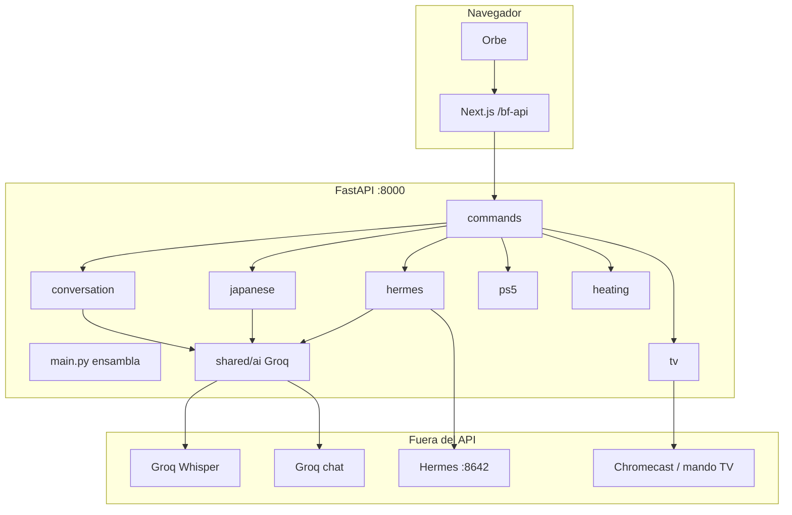
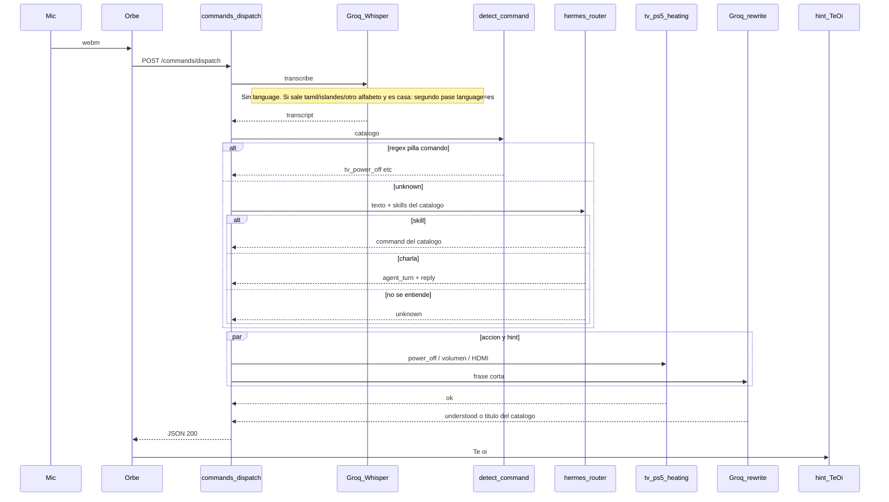
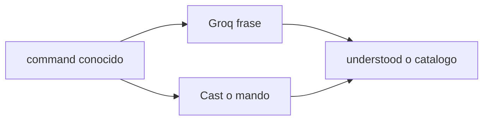

# Arquitectura: el flow de ahora

Besto Friendo es un **asistente de voz en casa** (tele, PS5, calefacción) y un **tutor de japonés**. El orbe graba, el backend decide qué hacer. Las API keys de IA **solo** están en el Mac (`backend/.env`), nunca en el navegador.

Este doc es el mapa del **turno de voz**. Cómo llega el teléfono al Mac está en [movil-y-portero.md](movil-y-portero.md).

## Piezas

Una feature **no** importa otra, **salvo** `commands`: es el orquestador. `hermes` no tiene HTTP propio; lo llama `commands`. `shared/ai` es Groq (Whisper + chat). El sidecar Hermes es opcional.

| Dónde | Qué |
| --- | --- |
| `frontend/src/app` | Rutas. Sin negocio. Proxy `/bf-api` → backend. |
| `frontend/src/features/conversation` | Orbe, hint «Te oí», `POST /commands/dispatch`. |
| `backend/app/main.py` | Routers y CORS. |
| `backend/app/features/commands` | Regex + catálogo + `dispatch`. |
| `backend/app/features/tv` `ps5` `heating` | Dispositivos. **No** van por un agente. |
| `backend/app/features/japanese` | Tutor (prompts). Sigue en Groq. |
| `backend/app/features/hermes` | Router de texto si el regex no pilla. |
| `backend/app/shared/ai` | Cliente Groq. |

## Un “oye, apaga la tele”

El front corta el fetch a los **20 s**. La tele no espera a Hermes. El hint Groq corre **a la vez** que Cast, no después.

### 1. Audio → texto

`POST /commands/dispatch` (`commands/controller.py` → `dispatch` en `commands/service.py`).

Whisper (`whisper-large-v3`) **sin** `language` para no romper inglés. En casa (`japanese_enabled=false`), si el texto parece **otro alfabeto** (tamil, islandés ð/þ, etc.) hay un segundo pase con `language=es`. El tutor japonés no hace ese retry.

### 2. Regex primero

`detect_command` mira el catálogo (tele, Play, calefacción, modos del tutor, Luna). Frases mezcladas tipo “ey qué tal, súbeme el volumen” las gana el **comando**. Hermes **no** enciende la tele.

### 3. Solo si `unknown`: router Hermes

El catálogo entra como **skills** en el prompt. El router **no ejecuta** nada: devuelve JSON (`command` id, o `agent_id` + `reply`).

- Sidecar si `HERMES_API_URL` apunta a `:8642`.
- Si no hay URL, el mismo prompt va a Groq.

Agentes en `backend/app/features/hermes/registry.py`: **chat** activo. `web`, `japanese`, `discord` están `planned` (no salen para que no los invente).

### 4. Ejecutar

| `command` | Quién |
| --- | --- |
| `tv_*` `ps5_*` `heating_*` | Feature del dispositivo (Cast, mando, MIGo…). |
| `japanese_turn` | Groq + `japanese`. Sin rewrite del hint. |
| `agent_turn` | Texto de chat. Sin tocar la tele. |
| `unknown` | Orbe confuso. Se enseña el STT crudo. |

### 5. Hint «Te oí»

Cuando ya hay `command` (no `japanese_turn` / `unknown`), Groq escribe una frase corta **en paralelo** con la acción. Presupuesto **3 s desde ese momento**. Si Cast tarda 5 s y Groq ya acabó, el `200` no espera más. Si Groq no llegó: título del catálogo (“Apagar tele”).

Eso **no** usa el sidecar: una frase no necesita tools (antes el agente Hermes se comía los 20 s del front).

El front muestra `understood` si viene; si no, el `transcript`.

## Qué no hace este flow

- Hermes **no** oye el webm. Solo texto después del STT.
- No hay tools de tele/PS5/calefacción en el agente.
- El tutor japonés **no** es el agente `japanese` del registry (sigue el código Groq de siempre).
- `POST /conversation/turn` existe para pruebas; el orbe usa **solo** `/commands/dispatch`.

## Archivos para seguir el código

- Dispatch: [`backend/app/features/commands/service.py`](../backend/app/features/commands/service.py)
- Catálogo: [`backend/app/features/commands/catalog.py`](../backend/app/features/commands/catalog.py)
- Router: [`backend/app/features/hermes/service.py`](../backend/app/features/hermes/service.py), [`skills.py`](../backend/app/features/hermes/skills.py), [`gateway.py`](../backend/app/features/hermes/gateway.py)
- STT: [`backend/app/shared/ai/groq.py`](../backend/app/shared/ai/groq.py)
- Front: [`frontend/src/features/conversation/hooks/useDispatchCommand.ts`](../frontend/src/features/conversation/hooks/useDispatchCommand.ts), [`applyDispatchResult.ts`](../frontend/src/features/conversation/hooks/applyDispatchResult.ts)
