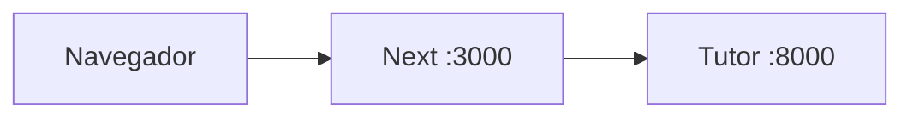
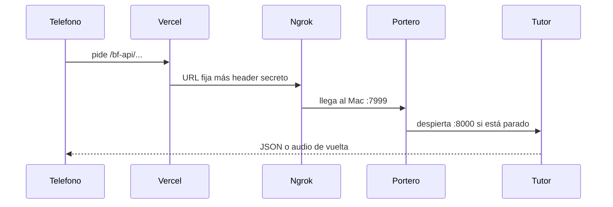

# Móvil, Vercel y el portero

El teléfono abre la web en Vercel, no en tu Mac. El tutor (el API grande) no tiene que estar siempre encendido: gasta CPU y deja Groq y la tele a un clic de distancia.

En el Mac vive un proceso pequeño, el **portero**. Un túnel (ngrok) le da una dirección HTTPS fija. Cuando el móvil pide algo, Vercel llama a esa dirección, el portero despierta el tutor si hace falta, y la respuesta vuelve al teléfono.

## Esquema

### Local (tú en el Mac)

Sin túnel y sin secreto. El navegador habla con Next en tu máquina; Next habla con el tutor en el mismo ordenador.

### Móvil (fuera de casa)

El teléfono solo ve Vercel. Vercel sí conoce la URL de ngrok y el secreto; el JavaScript del navegador no.

## Cada pieza, en palabras simples

### Teléfono

Abres [https://besto-friendo.vercel.app](https://besto-friendo.vercel.app). No ves el Mac, no ves el puerto 8000, no ves el secreto. Solo una web HTTPS (hace falta para el micrófono).

### Vercel

La página pide rutas que empiezan por `/bf-api` (mismo sitio, mismo origen). Un Route Handler en el servidor ([`frontend/src/app/bf-api/[...path]/route.ts`](../frontend/src/app/bf-api/[...path]/route.ts)) reenvía eso a `BACKEND_URL` (ngrok) y pone el header `X-Besto-Boot` con `BACKEND_WAKE_KEY`. Esos valores son Secrets de Vercel, no van en el JS.

Si `GATE_PASSWORD` está definido, primero pide esa clave. El teléfono guarda un token HMAC (`X-Besto-Gate`), no la contraseña. Sin token válido, `/bf-api` responde 401 y no llama a ngrok. En `localhost` deja `GATE_PASSWORD` vacío.

### Ngrok

Puerta pública con hostname fijo (`pug-stump-approve.ngrok-free.dev`) hacia el Mac, puerto **7999** (el portero), no el 8000. Sin Mac despierto y sin ngrok, Vercel no llega a casa.

### Portero

FastAPI aparte (`app.boot`), puerto **7999**. Lo levanta [`scripts/mac-home-api.sh`](../scripts/mac-home-api.sh) o `./scripts/start-grok`. Comprueba el secreto. Si el tutor no está, lo enciende ([`backend/app/features/boot/service.py`](../backend/app/features/boot/service.py)) y luego copia la petición.

### Tutor

FastAPI de verdad (`app.main`), puerto **8000**: conversación, tele, el resto. Puede estar parado hasta la primera petición del móvil.

## Paso a paso de una petición (móvil)

1. Grabas o pulsas algo en el teléfono. El navegador pide `/bf-api/...` a Vercel.
2. Vercel comprueba el token de la app (`GATE_PASSWORD`). Si vale, mira `BACKEND_URL` y `BACKEND_WAKE_KEY`, pone el header secreto y llama a ngrok.
3. Ngrok mete esa llamada en tu Mac, al portero `:7999`.
4. El portero mira el header. Si no coincide, responde 401 y se acaba.
5. El portero mira si el tutor está despierto en `:8000`.
6. Si no lo está, lo enciende y espera a que escuche.
7. Copia método, ruta y cuerpo al tutor.
8. El tutor hace el trabajo (Whisper, chat, tele…) y responde.
9. La respuesta vuelve: portero → ngrok → Vercel → teléfono.

## Por qué hay un secreto

Si ngrok estuviera abierto a cualquiera, podrían mandar órdenes a la tele o al tutor. El header solo lo pone Vercel; el teléfono no lo conoce.

En local no hace falta: `.env.local` apunta a `http://localhost:8000` y **no** lleva `BACKEND_WAKE_KEY`.

## Qué tiene que estar encendido

| Dónde | En el Mac | En Internet |
|--------|-----------|-------------|
| Local (`localhost:3000`) | `pnpm dev` + uvicorn del tutor `:8000` | Nada (ni ngrok ni Vercel) |
| Móvil | Portero `:7999` + ngrok. El tutor puede estar parado | Vercel + hostname fijo de ngrok |

El Mac no puede estar dormido: el túnel se cae y el portero no responde.
